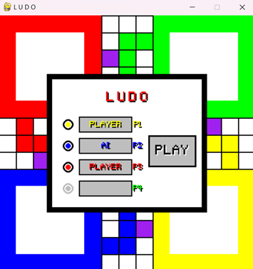

# Ludo Game Project

## Overview

This project is a digital implementation of the classic board game **Ludo**, designed using Object-Oriented Programming (OOP) principles. The game allows for both human and AI players, providing an engaging gaming experience while demonstrating core OOP concepts such as encapsulation, inheritance, and polymorphism.

---

## Table of Contents
- [Features](#features)
- [Classes and Their Responsibilities](#classes-and-their-responsibilities)
- [Gameplay Instructions](#gameplay-instructions)
- [AIPlayer Development Status](#aiplayer-development-status)
- [Naming Conventions](#naming-conventions)

---

## Features
- Support for multiple players, including human and AI players.
- Dice rolling mechanics to determine movement.
- Piece movement and capturing mechanics.
- A user-friendly interface with visual representation of the game board.

## Classes and Their Responsibilities

### 1. `Game`
- Manages the overall game flow, including player turns, dice rolls, and game state.

### 2. `Player`
- Represents a player in the game. Manages the player's pieces and provides methods for movement and capturing.

### 3. `HumanPlayer`
- Inherits from `Player` and handles user input for selecting pieces and making moves.

### 4. `AIPlayer`
- Inherits from `Player` and implements automated gameplay logic, determining the best moves based on the current game state.

### 5. `Piece`
- Represents a game piece, managing its position, state (in lobby, on board, or at goal), and movement logic.

### 6. `Dice`
- Represents a dice object, handling the rolling mechanics and providing the rolled value.

---

## Gameplay Instructions

- The game can be played with 2 to 4 players.
- Each player takes turns rolling the dice and moving their pieces according to the rolled value.
- Players can capture opponent pieces by landing on the same space.
- The first player to get all their pieces to the finish line wins the game!

## AIPlayer Development Status

The `AIPlayer` class is currently under development and aims to implement automated gameplay logic for the game. Here are the key objectives and features expected from the `AIPlayer`:

### Objectives
- **Automated Decision-Making:** The `AIPlayer` will evaluate the game state and make decisions without requiring user input, simulating a human player's actions.
  
- **Movement Logic:** It will determine which pieces to move based on the rolled dice value, ensuring optimal moves to achieve victory.

- **Heuristics and Simple Rules:**
  - **Maximum Advancement:** The AI will choose the piece that can advance the most based on the dice value.
  - **Aggressiveness:** The AI will prioritize capturing opponent pieces when possible.
  
- **Strategic Decision-Making:**
  - The AI will prioritize moving pieces closer to the goal while also protecting its own pieces from being captured.

### Current State
As of now, the `AIPlayer` is ***in progress*** and does not yet have fully implemented logic for decision-making. Future updates will focus on building out the `update` method and integrating the necessary algorithms to fulfill the objectives outlined above.

---

## Naming Conventions

### 1. Variables, Functions, Modules, and Packages
- **Format:** Use `snake_case` for naming variables, functions, modules, and packages.
- **Examples:** 
  - Variables: `total_sum`, `user_age`, `max_value`
  - Functions: `calculate_area()`, `fetch_user_data()`, `validate_input()`
  - Modules: `data_processing`, `user_management`, `payment_gateway`
  - Packages: `my_package`, `utils_module`

### 2. Classes
- **Format:** Use `PascalCase` for naming classes.
- **Examples:** `UserProfile`, `OrderManager`, `DataProcessor`

### 3. Abbreviations
- **Guideline:** Abbreviations are allowed when they are widely recognized (e.g., use `info` instead of `information`).
  
### 4. Comments
- **Guideline:** Comments can be written in English or Portuguese, but should only explain the *why* of the code, not the *how* it works.

### Final Note
Following these conventions is essential for maintaining consistency and readability throughout the project. Non-compliance may lead to code that is difficult to maintain and understand.
